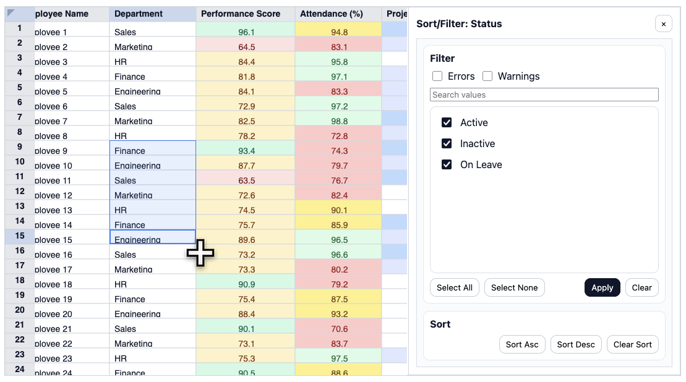

# Extable

Excel-like HTML table component with a fixed column schema (similar to Google Sheets’ table mode) and built-in multi-user editing.

## Documentation

The docs site is built with VitePress from `docs/pages` and deployed to GitHub Pages.

- Repo-pages URL (typical): `https://shibukawa.github.io/extable/`
- Local dev: `npm run docs:dev`

## Demos

- Vanilla demo (port `5173`): `npm run dev:demo`
- React demo (port `5174`): `npm run dev:demo-react`
- Vue demo (port `5175`): `npm run dev:demo-vue`

## Development

- Node: `>=22`
- Install: `npm install --cache .npm-cache`
- Build: `npm run build`
- Test: `npm run test`

## License

Apache-2.0. See `LICENSE`.

