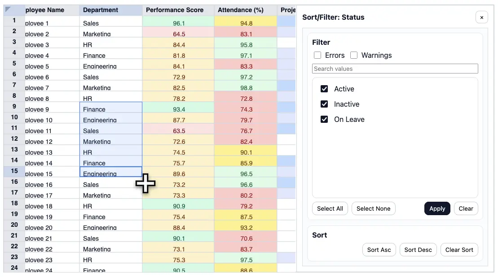

# @extable/core

[](https://www.npmjs.com/package/@extable/core)
[](https://www.typescriptlang.org/)
[](../LICENSE)
[](https://github.com/shibukawa/extable/actions/workflows/test.yml)
[](https://bundlephobia.com/package/@extable/core)



Excel-like HTML table component with a fixed column schema and built-in multi-user editing support.

## Features

- **Excel Familiarity** - Direct cell editing, fill handle, copy & paste, built-in filtering & sorting
- **Performance** - HTML5 Canvas rendering for thousands of rows, with HTML table mode for testing
- **Schema-Driven** - Centralized column definitions with validation, formatting, and formulas
- **Edit Modes** - View-only, direct edit, or commit-based workflows
- **Collaboration-Ready** - Row-level locking and command-stream architecture for multi-user support
- **Framework-Agnostic** - Core library works with Vanilla JS, React, Vue, and other frameworks

## Quick Start

### Installation

```bash
npm install @extable/core
```

### Basic Usage

```typescript
import { ExtableCore } from "@extable/core";
import "@extable/core/style.css";

const schema = {
  columns: [
    { key: "id", header: "ID", type: "string", readonly: true },
    { key: "name", header: "Name", type: "string" },
    { key: "active", header: "Active", type: "boolean" },
  ],
};

const data = [
  { id: "1", name: "Alice", active: true },
  { id: "2", name: "Bob", active: false },
];

const table = new ExtableCore({
  root: document.getElementById("table"),
  schema,
  defaultData: data,
  defaultView: {},
});
```

## Documentation

For comprehensive guides and examples, visit the [Extable Documentation](https://shibukawa.github.io/extable/).

### Key Topics

- [Concepts](https://shibukawa.github.io/extable/concepts/) - Design philosophy and architecture
- [Integration Guide](https://shibukawa.github.io/extable/guides/integration) - Setup and configuration
- [Data Format](https://shibukawa.github.io/extable/guides/data-format) - Supported column types and validation
- [Edit Modes](https://shibukawa.github.io/extable/guides/editmode) - View-only, direct, and commit modes
- [Core API Reference](https://shibukawa.github.io/extable/reference/core) - Complete API documentation
- [Demos](https://shibukawa.github.io/extable/demos/) - Interactive examples

## Framework Wrappers

Use Extable with your favorite framework:

- **React**: [@extable/react](https://www.npmjs.com/package/@extable/react)
- **Vue**: [@extable/vue](https://www.npmjs.com/package/@extable/vue)

## Repository

GitHub: https://github.com/shibukawa/extable

## License

Apache License 2.0 - See LICENSE for details.
